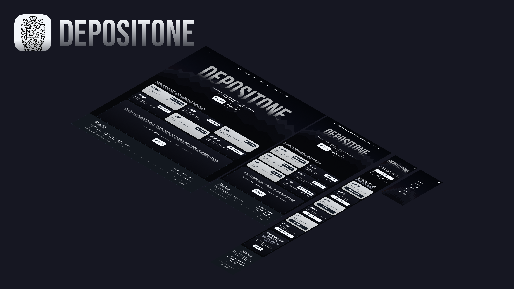

# DepositOne

**DepositOne** - full-stack веб-приложение для управления банковскими вкладами. Внутренняя платформа сотрудника банка: учёт вкладчиков, вкладов и договоров, аналитика по портфелю, отчёты по денежным потокам и график возврата средств.

Автор: Богдан Витряк, группа ОКБИ-204Б, Московский Технологический Институт.

## Содержание

- [Возможности](#возможности)
- [Технологический стек](#технологический-стек)
- [Архитектура](#архитектура)
- [Быстрый старт](#быстрый-старт)
- [Переменные окружения](#переменные-окружения)
- [Порты](#порты)
- [Начальные данные](#начальные-данные)
- [Проверка репликации](#проверка-репликации)
- [Структура проекта](#структура-проекта)
- [Соответствие требованиям](#соответствие-требованиям)
- [Дизайн](#дизайн)
- [Git и коммиты](#git-и-коммиты)
- [Документация](#документация)
- [Лицензия](#лицензия)

## Возможности

- Регистрация и вход сотрудников, защита через JWT.
- Полный CRUD над вкладчиками, вкладами и договорами.
- Поиск, фильтрация, сортировка и пагинация на уровне запросов к базе.
- Автоматический расчёт срока вклада, начисленных и итоговых процентов.
- Пересчёт сумм в выбранную валюту (USD, EUR, RUB).
- Аналитическая панель `/dashboard` с диаграммами на Highcharts.
- Отчёты по денежным потокам и доходности вкладчиков.
- План возврата с расписанием выплат и приоритетами.
- Профиль `/<username>` с выпуском нового JWT токена.
- Публичные страницы `/about` (HTML) и `/api/about` (JSON), эндпоинт хеша `/api/hash/{str}`.
- Резервные ответы при недоступности базы или сервиса.

## Технологический стек

| Слой | Технологии |
| --- | --- |
| Frontend | HTML, CSS, JavaScript, Highcharts |
| Сервис Core | Python, FastAPI (бизнес-логика) |
| Сервис Supporting | Python, Flask (API Gateway, отчёты, авторизация) |
| База данных | PostgreSQL 18, репликация Master-Slave |
| Авторизация | JWT (HS256) |
| Доступ к данным | SQL без ORM (psycopg) |
| Инфраструктура | Docker, Docker Compose, Nginx |

## Архитектура

Приложение состоит из пяти контейнеров. Nginx (порт 8080) отдаёт статику и проксирует запросы `/api/*` в нужный сервис. Сервис Core (FastAPI, 8002) и сервис Supporting (Flask, 8001) работают с базой PostgreSQL: Master на порту 5432 и реплика только для чтения на порту 5433. Оба сервиса построены по слоистой схеме Routes, Controllers, Services, Repositories, Models.

- Core (FastAPI): вкладчики, вклады, договоры, справочники, портфель, план возврата.
- Supporting (Flask): авторизация, профиль, отчёты, уведомления, панель, about, hash.

Подробно в [docs/Architecture.md](docs/Architecture.md).

## Быстрый старт

Пошаговая настройка от нуля до первого запуска. Другие команды не нужны, всё поднимается через Docker Compose.

### 1. Установите Docker

Нужны Docker и Docker Compose (входит в Docker Desktop). Docker Desktop должен быть запущен. Проверка версий:

```bash
docker --version
docker compose version
```

### 2. Получите проект

```bash
git clone https://github.com/Bvitriak/DepositOne.git
cd DepositOne
```

### 3. Создайте файл .env

```bash
cp .env.example .env
```

Файл `.env` обязателен: без него база не пройдёт проверку здоровья и сервисы не стартуют.

### 4. Заполните .env

Откройте `.env` и замените все значения `change-me` на свои. Пример:

```
POSTGRES_DB=depositone
POSTGRES_USER=depositone
POSTGRES_PASSWORD=StrongPass123
REPLICATION_PASSWORD=StrongReplica123
JWT_SECRET=6f1c2b9a4e7d0f3a8c5b1e9d2a4f6c8b
```

`JWT_SECRET` должен быть длинной случайной строкой. Сгенерировать можно так:

```bash
openssl rand -hex 32
```

Назначение каждой переменной - в разделе [Переменные окружения](#переменные-окружения).

### 5. Соберите и запустите

```bash
docker compose up --build
```

При первом запуске собираются образы, стартует Master, создаётся схема и тестовые данные (`init.sql`, `seed.sql`), затем реплика делает базовую копию через `pg_basebackup` и поднимается как standby. Это занимает 1-2 минуты. Дождитесь, пока в логах появятся строки о готовности сервисов.

### 6. Откройте приложение

Перейдите на `http://localhost:8080`, зарегистрируйте аккаунт на странице регистрации и войдите.

### Полезные команды

```bash
docker compose up --build -d   # запуск в фоне
docker compose ps              # статус контейнеров
docker compose logs -f         # логи всех сервисов
docker compose down            # остановка
docker compose down -v         # остановка с полной очисткой данных БД
```

## Переменные окружения

Файл `.env` обязателен. Шаблон - [.env.example](.env.example).

| Переменная | Назначение |
| --- | --- |
| POSTGRES_DB | Имя базы данных |
| POSTGRES_USER | Пользователь базы |
| POSTGRES_PASSWORD | Пароль пользователя базы |
| REPLICATION_PASSWORD | Пароль роли репликации |
| JWT_SECRET | Секрет для подписи JWT (общий для сервисов) |

## Порты

| Сервис | Внешний порт | Назначение |
| --- | --- | --- |
| frontend (Nginx) | 8080 | Веб-интерфейс и шлюз API |
| core (FastAPI) | 8002 | Сервис бизнес-логики |
| supporting (Flask) | 8001 | Вспомогательный сервис |
| db (Master) | 5432 | Основная база данных |
| db_replica (Slave) | 5433 | Реплика только для чтения |

## Начальные данные

При первом запуске база наполняется тестовыми данными из [database/seed.sql](database/seed.sql): пользователь `admin` (email `admin@depositone.com`, пароль хранится как bcrypt хеш), 5 вкладчиков, 6 вкладов и 3 договора. Для входа зарегистрируйте свой аккаунт на странице регистрации.

## Проверка репликации

```bash
# на Master: активные подключения репликации
docker compose exec db psql -U depositone -d depositone -c "SELECT client_addr, state FROM pg_stat_replication;"

# на реплике: true означает режим только для чтения
docker compose exec db_replica psql -U depositone -d depositone -c "SELECT pg_is_in_recovery();"
```

## Структура проекта

- `backend/core` - сервис Core (FastAPI): controllers, services, repositories, routes, models.
- `backend/supporting` - сервис Supporting (Flask): те же слои.
- `database` - init.sql (схема, индексы, справочники), seed.sql, скрипты Master и реплики.
- `frontend` - HTML, CSS, JavaScript, ассеты.
- `docs` - документация.
- `.github` - CI, шаблоны, политики.
- `docker-compose.yml`, `Dockerfile`, `nginx.conf` - инфраструктура.

## Соответствие требованиям

Кратко (полная таблица - в [docs/Requirements.md](docs/Requirements.md)):

- Два сервиса разными фреймворками: Core (FastAPI) и Supporting (Flask).
- Три связанные сущности: вкладчики, вклады, договоры, схема в 3НФ.
- Регистрация и вход с JWT, защита маршрутов.
- Доступ к данным только через SQL, без ORM.
- Поиск, фильтрация, сортировка и пагинация на уровне БД.
- CRUD модуль для главных сущностей.
- Репликация PostgreSQL Master-Slave.
- Эндпоинты `/dashboard`, `/<username>`, `/about`, `/api/about`, `/api/hash/{str}`.
- Резервные ответы при сбоях.

## Дизайн

Макет интерфейса опубликован в Figma Community: [DepositOne в Figma](https://www.figma.com/community/file/1683550893869879528).

## Git и коммиты

Стратегия ветвления:

- `main` - финальное состояние проекта и README.
- `dev` - интеграция реализованных функций.
- `feature/<username>/<task-name>` - отдельные задачи, создаются от `dev` и вливаются обратно в `dev`.
- `release/vX.Y` - подготовка к сдаче.

Правила коммитов: один коммит - одно логическое изменение, сообщения на английском, формат `<type>: <short description>` (feat, fix, docs, style, refactor, perf, seed, test). Подробнее - в [.github/CONTRIBUTING.md](.github/CONTRIBUTING.md).

## Документация

- [Аннотация](docs/ANNOTATION.md)
- [Требования и их выполнение](docs/Requirements.md)
- [Архитектура](docs/Architecture.md)
- [База данных](docs/Database.md)
- [Справочник API](docs/Api.md)
- [Руководство пользователя](docs/UserGuide.md)

## Лицензия

[MIT](LICENSE).
